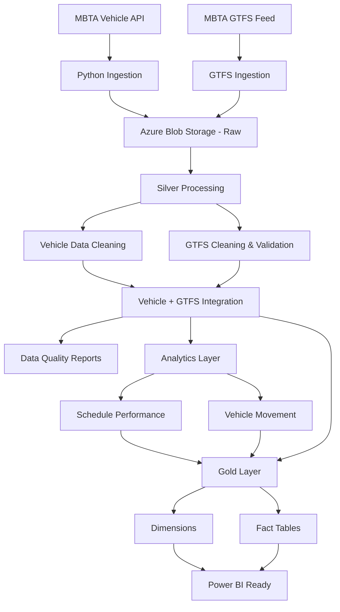

# Azure Mobility Data Platform

An end-to-end cloud data engineering project that ingests real-time public transportation data and GTFS reference data, processes it through Raw, Silver, Analytics, and Gold layers in Azure Blob Storage, applies data-quality validation, integrates live vehicle observations with transit schedules, and produces analytics-ready fact and dimension tables.

The project uses public MBTA transportation data and demonstrates a practical medallion-style data architecture using Python, Pandas, Azure Blob Storage, GTFS, and analytics-ready dimensional modelling.

---

## Project Overview

The platform processes two primary data sources:

- **MBTA Real-Time Vehicle API** — live vehicle positions, routes, trips, stops, speed, bearing, and operational status.
- **MBTA GTFS Static Feed** — routes, stops, trips, stop times, shapes, calendars, and service schedules.

The pipeline performs:

- API ingestion
- Raw data storage
- Data cleaning and standardization
- Data-quality validation
- GTFS relationship validation
- Vehicle + GTFS enrichment
- Exception monitoring
- Schedule-performance analytics
- Vehicle-movement analytics
- Dimensional modelling
- Gold-layer validation

---

## Architecture



---

## Azure Data Architecture

### Raw Layer

Stores source data with minimal transformation.

```text
raw/
├── vehicle_positions_<timestamp>.csv
└── gtfs/
    ├── routes.txt
    ├── stops.txt
    ├── trips.txt
    ├── stop_times.txt
    ├── shapes.txt
    ├── calendar.txt
    └── calendar_dates.txt
```

Vehicle snapshots are timestamped so historical observations can be retained for movement analytics.

---

## Silver Layer

The Silver layer contains cleaned, validated, and integrated datasets.

```text
silver/
├── vehicle_positions_clean_<timestamp>.csv
├── vehicle_positions_exceptions_<timestamp>.csv
│
├── gtfs/
│   ├── routes_clean.csv
│   ├── stops_clean.csv
│   ├── trips_clean.csv
│   ├── stop_times_clean.csv
│   ├── shapes_clean.csv
│   ├── calendar_clean.csv
│   ├── calendar_dates_clean.csv
│   ├── gtfs_exceptions.csv
│   └── gtfs_validation_summary.csv
│
├── integrated/
│   └── vehicle_gtfs_integrated_<timestamp>.csv
│
├── analytics/
│   ├── schedule_performance_<timestamp>.csv
│   └── vehicle_movement_<timestamp>.csv
│
└── reports/
    ├── data_quality_report_<timestamp>.csv
    └── integration_exception_summary_<timestamp>.csv
```

---

## Gold Layer

The Gold layer contains analytics-ready dimensional models.

```text
gold/
├── dimensions/
│   ├── dim_route.csv
│   ├── dim_stop.csv
│   ├── dim_trip.csv
│   └── dim_date.csv
│
├── facts/
│   ├── fact_vehicle_observation.csv
│   ├── fact_vehicle_movement.csv
│   └── fact_schedule_performance.csv
│
└── reports/
    └── gold_validation_summary.csv
```

### Dimensions

**dim_route**

Contains route-level descriptive information such as route name, type, color, and sort order.

**dim_stop**

Contains transit stop information including coordinates, municipality, zone, and accessibility attributes.

**dim_trip**

Contains trip, service, route, direction, shape, and accessibility information.

**dim_date**

Provides standard calendar attributes for date-based analytics.

### Fact Tables

**fact_vehicle_observation**

Stores live vehicle observations enriched with GTFS identifiers and integration status.

**fact_vehicle_movement**

Stores calculated vehicle movement between snapshots including:

- distance travelled
- observation time difference
- calculated speed
- movement status

**fact_schedule_performance**

Stores scheduled-versus-observed transit performance including:

- scheduled arrival
- scheduled departure
- arrival deviation
- departure deviation
- schedule status

---

## Latest Pipeline Results

### Vehicle Data

```text
Raw vehicle observations:        1,697
Clean Silver observations:       1,697
Vehicle Silver exceptions:           0
```

### GTFS Processing

```text
Routes:             402
Stops:           10,280
Trips:          122,478
Stop Times:   3,155,220
Shapes:         389,618
Calendar:           133
Calendar Dates:     131
```

### GTFS Data Quality

```text
Duplicate Route IDs:          0
Duplicate Stop IDs:           0
Duplicate Trip IDs:           0
Duplicate Shape Point Keys:   0

Invalid Trip → Route:         0
Invalid Stop Time → Trip:     0
Invalid Stop Time → Stop:     0
Invalid Trip → Shape:         0
```

605 stop records were identified with missing latitude and longitude values and were retained as documented GTFS data-quality exceptions.

---

## Vehicle + GTFS Integration

A total of **1,697 live vehicle observations** were integrated with GTFS reference data.

```text
Route Match:          100.00%
Trip Match:            93.87%
Stop Match:            95.34%
Full Integration:      93.87%
Partial Integration:    6.13%
```

Integration exception categories:

```text
No Exception:                         1,593
Shuttle Trip/Stop Not In GTFS:           79
Realtime Trip Not In GTFS:               25
```

---

## Schedule Performance Analytics

The pipeline joined live vehicle observations with scheduled GTFS stop times.

```text
Schedule-matched observations: 1,566

ON_TIME:   965
DELAYED:   332
EARLY:     269
```

Classification thresholds:

```text
EARLY     < -5 minutes
ON_TIME   -5 to +5 minutes
DELAYED   > +5 minutes
```

GTFS schedule times above 24:00:00 are supported by converting them into seconds after midnight before scheduled datetimes are calculated.

Schedule deviation should be interpreted as an analytical proxy because a realtime vehicle observation timestamp does not necessarily represent an exact physical stop-arrival event.

---

## Vehicle Movement Analytics

Vehicle movement is calculated by comparing consecutive observations for the same vehicle.

The pipeline uses the Haversine formula to calculate geographic distance between consecutive coordinates.

```text
Movement records: 1,033

VALID:        463
STATIONARY:   111
DATA_GAP:     459
```

Observation gaps greater than 15 minutes are classified as `DATA_GAP` and excluded from calculated-speed analysis.

---

## Gold Layer Results

```text
dim_route:                         402
dim_stop:                       10,280
dim_trip:                      122,478
dim_date:                            1

fact_vehicle_observation:        1,697
fact_vehicle_movement:           1,033
fact_schedule_performance:       1,566
```

The current `dim_date` contains one date because the Azure snapshots used for this project run were collected on the same day. Additional pipeline runs automatically expand the date dimension.

---

## Gold Layer Validation

The Gold layer passed all implemented validation checks.

```text
Duplicate dimension keys:                 0
Invalid FULL_MATCH observation routes:    0
Invalid FULL_MATCH observation stops:     0
Invalid FULL_MATCH observation trips:     0
Invalid movement routes:                  0
Invalid schedule routes:                  0
Invalid schedule stops:                   0
Invalid schedule trips:                   0
Negative movement distances:              0
Negative movement time differences:       0
Missing arrival deviations:               0
```

Final validation result:

```text
GOLD LAYER VALIDATION: PASSED
```

---

## Technologies Used

- Python 3.10
- Pandas
- NumPy
- Requests
- Azure Blob Storage
- Azure Storage Blob Python SDK
- Azure Identity
- GTFS
- MBTA API
- Git
- GitHub
- Power BI

---

## Python Azure Pipeline

Azure-specific pipeline scripts are located under:

```text
python/azure/
```

Current scripts:

```text
build_gold_layer.py
data_quality_report.py
ingest_gtfs.py
ingest_vehicle_positions.py
integrate_vehicle_gtfs.py
process_gtfs_to_silver.py
process_raw_to_silver.py
run_analytics.py
run_azure_pipeline.py
validate_gtfs_silver.py
```

---

## Pipeline Orchestration

For a normal live vehicle refresh:

```powershell
python .\python\azure\run_azure_pipeline.py
```

This executes:

```text
Vehicle ingestion
        ↓
Raw → Silver
        ↓
Vehicle + GTFS integration
        ↓
Data Quality
        ↓
Analytics
        ↓
Gold layer
```

GTFS does not need to be reprocessed for every live vehicle snapshot.

For a complete GTFS and vehicle refresh:

```powershell
python .\python\azure\run_azure_pipeline.py --full-refresh
```

---

## Azure Authentication

The Azure Storage connection string is loaded using an environment variable and is never hardcoded in the source code.

Example:

```powershell
$env:AZURE_STORAGE_CONNECTION_STRING="YOUR_CONNECTION_STRING"
```

Secrets and Azure Storage account keys must never be committed to GitHub.

---

## Data Quality Rules

The pipeline contains validation for:

- missing vehicle IDs
- invalid latitude and longitude
- invalid bearing values
- missing route IDs
- missing trip IDs
- invalid timestamps
- duplicate vehicle snapshots
- missing GTFS coordinates
- invalid GTFS coordinates
- broken trip → route relationships
- broken stop time → trip relationships
- broken stop time → stop relationships
- broken trip → shape relationships
- duplicate dimensional keys
- referential integrity between Gold facts and dimensions
- negative movement distance
- negative movement time
- valid movement statuses
- valid schedule statuses

---

## Repository Structure

```text
Azure Mobility Data Platform/
│
├── data/
│   ├── raw/
│   └── processed/
│
├── python/
│   ├── azure/
│   ├── clean_vehicle_positions.py
│   ├── clean_gtfs.py
│   ├── integrate_vehicle_gtfs.py
│   ├── calculate_schedule_performance.py
│   ├── calculate_vehicle_movement.py
│   ├── build_dimensions.py
│   ├── build_dim_date.py
│   ├── build_fact_vehicle_observation.py
│   ├── build_fact_vehicle_movement.py
│   ├── build_fact_schedule_performance.py
│   └── validate_gold_layer.py
│
├── requirements.txt
└── README.md
```

---

## Project Objective

The goal of this project is to demonstrate an end-to-end cloud data engineering workflow that combines:

- real-time API ingestion
- large static reference datasets
- cloud object storage
- medallion architecture
- ETL/ELT processing
- data-quality monitoring
- data integration
- transportation analytics
- dimensional modelling
- analytics-ready Gold datasets

The resulting Gold tables are structured for downstream reporting and Power BI modelling.